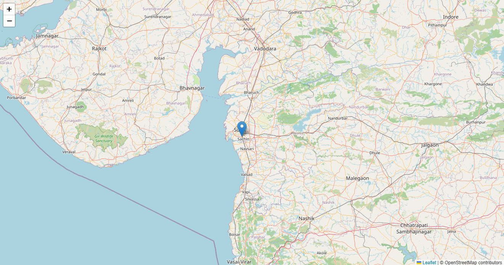

# 🗺️ Leaflet + OpenStreetMap Location App

A simple web app built using **Express, EJS, and Leaflet.js** to
understand how **maps, geolocation, and deployment** work.

---

---

## 📸 Screenshots



---

## 🎯 Purpose

This project was created to learn: - 🌍 How **OpenStreetMap (OSM)**
works with Leaflet - 📍 How to fetch and display **user location** - 🚀
How to **deploy an EJS-based Node.js app** on platforms like Render

---

## ⚙️ Tech Stack

### Backend 🧠

- Node.js
- Express.js
- EJS (templating)

### Frontend 🎨

- Leaflet.js
- OpenStreetMap tiles
- Browser Geolocation API

---

## ✨ Features

- 🗺️ Interactive map using Leaflet\
- 📍 Detects user's live location\
- 🎯 Centers map dynamically\
- 📌 Adds marker at current position\
- ⚡ Lightweight and beginner-friendly

---

## 🚀 Learnings

- 🧱 How Leaflet initializes maps and handles tiles\
- 🌍 Understanding OSM tile system (z/x/y)\
- 📡 Using `navigator.geolocation`\
- 🚀 Deploying Node.js + EJS apps\

---

## 🟢 Run Locally

```bash
git clone <repo-url>
cd project-folder
npm install
node src/app.js
```

Open: http://localhost:4000

---

## ⚠️ Notes

- Geolocation requires **HTTPS or localhost**
- Browser will ask for **location permission**

---

## 🧠 Why I Made This

To understand maps and deployment instead of treating them like a black
box.

_Turns out it's just coordinates doing all the work 😄_
